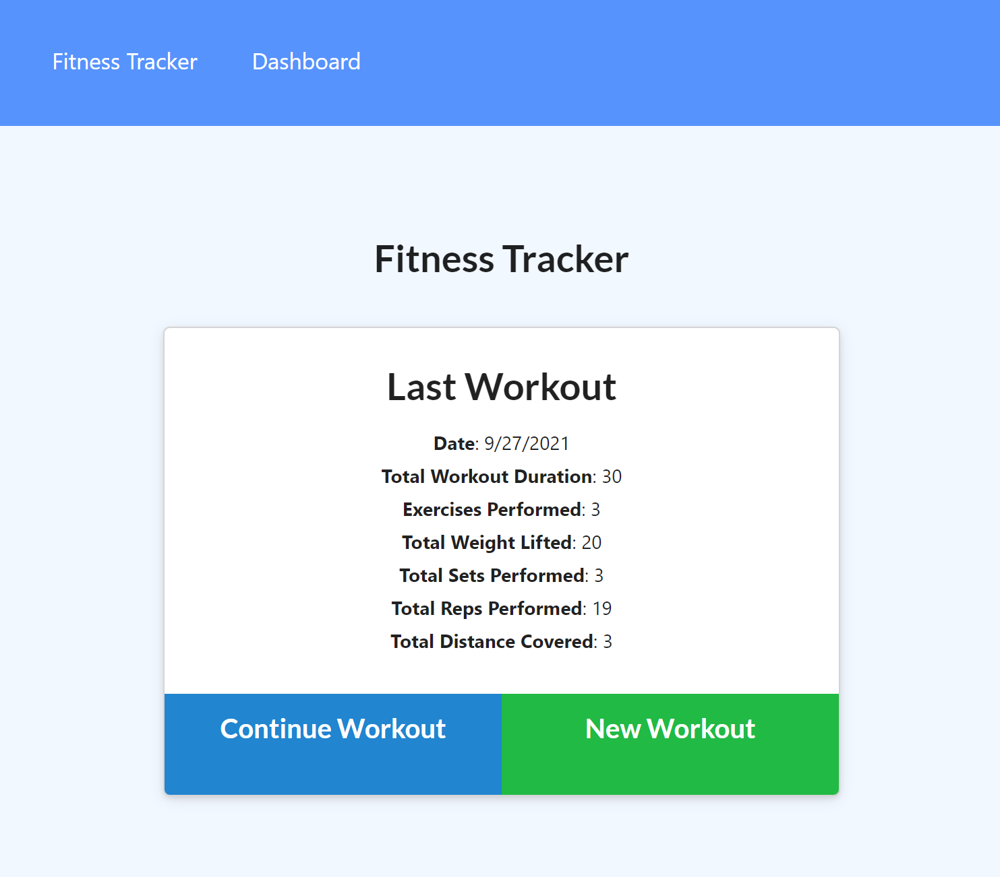
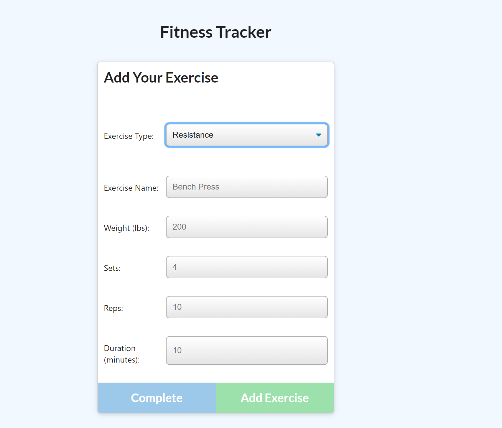
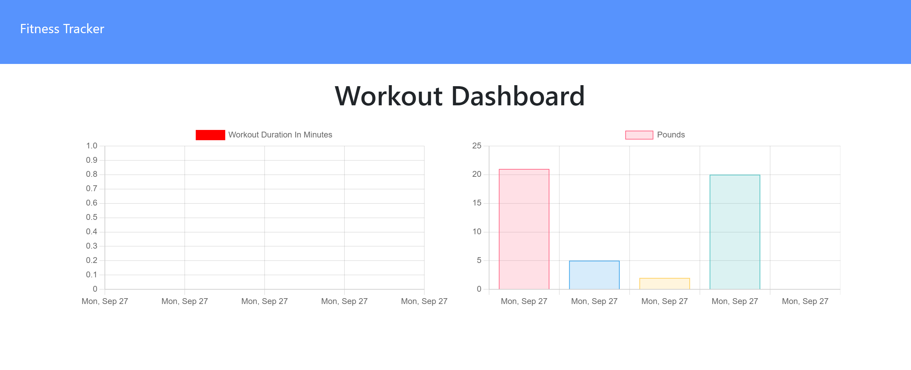

# Fitness Tracker

  
  
  ## Description

  This program tracks the users workouts and details (i.e. weight, reps, sets, duration, distance, etc.). Will also allow user to compare their workouts over the last seven days on the dashboard.

  ## Table of Contents
  - [Installation](#installation)
  - [Usage](#usage)
  - [Credits](#credits)
  - [License](#license)

  ## Installation

  Clone the project from the repository, then in the terminal and run 'npm install' to gather all the dependencies. Finally run 'npm start' in terminal to get project running locally. Can also go to the link provided

  ## Usage

  User begins on the Fitness Tracker Page where they can see the stats of their last workout then choose to add an exercise to the previous workout or to start a new workout regime.
  
  
  
  For adding an exercise the user selects a workout type which would then give them options to fill in the details of their exercise. User can add as many exercises to a workout as they would like. 
  
  
  
  For comparison purposes user can go to the Dashboard page to view their progress in their workouts over the last seven days (if workout data is available for that timeframe).

  

  ## Credits

  [MongoDb Documentation](https://docs.mongodb.com/)

  Frontend Code Provided By OSU Bootcamp

  Celina M. Lind

 Contact me with any questions at my email clind323@gmail.com or at my GitHub clind3

  ## License

  MIT License

Copyright (c) [2021] [Celina Lind]

Permission is hereby granted, free of charge, to any person obtaining a copy
of this software and associated documentation files (the "Software"), to deal
in the Software without restriction, including without limitation the rights
to use, copy, modify, merge, publish, distribute, sublicense, and/or sell
copies of the Software, and to permit persons to whom the Software is
furnished to do so, subject to the following conditions:

The above copyright notice and this permission notice shall be included in all
copies or substantial portions of the Software.

THE SOFTWARE IS PROVIDED "AS IS", WITHOUT WARRANTY OF ANY KIND, EXPRESS OR
IMPLIED, INCLUDING BUT NOT LIMITED TO THE WARRANTIES OF MERCHANTABILITY,
FITNESS FOR A PARTICULAR PURPOSE AND NONINFRINGEMENT. IN NO EVENT SHALL THE
AUTHORS OR COPYRIGHT HOLDERS BE LIABLE FOR ANY CLAIM, DAMAGES OR OTHER
LIABILITY, WHETHER IN AN ACTION OF CONTRACT, TORT OR OTHERWISE, ARISING FROM,
OUT OF OR IN CONNECTION WITH THE SOFTWARE OR THE USE OR OTHER DEALINGS IN THE
SOFTWARE.
  
  
  